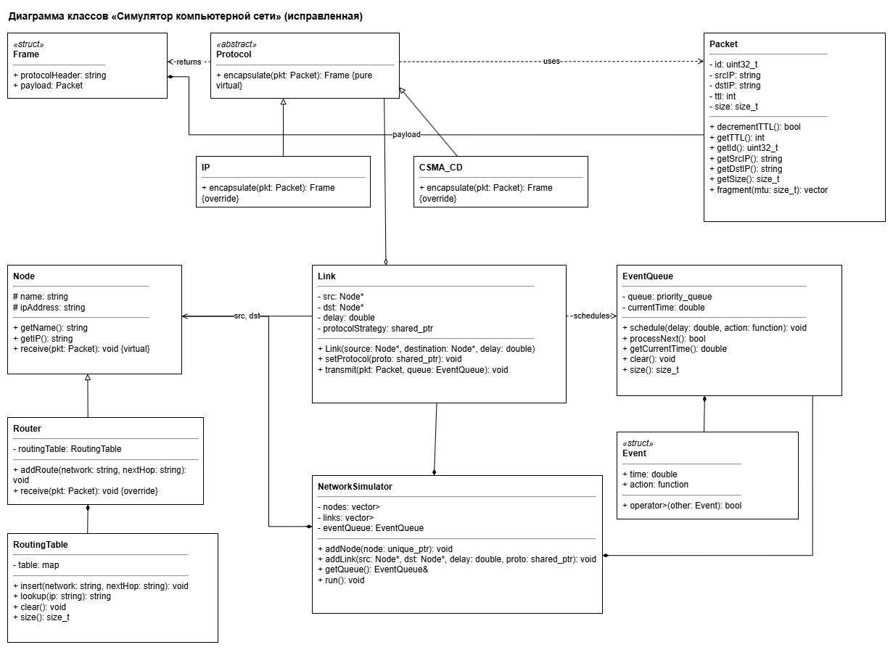
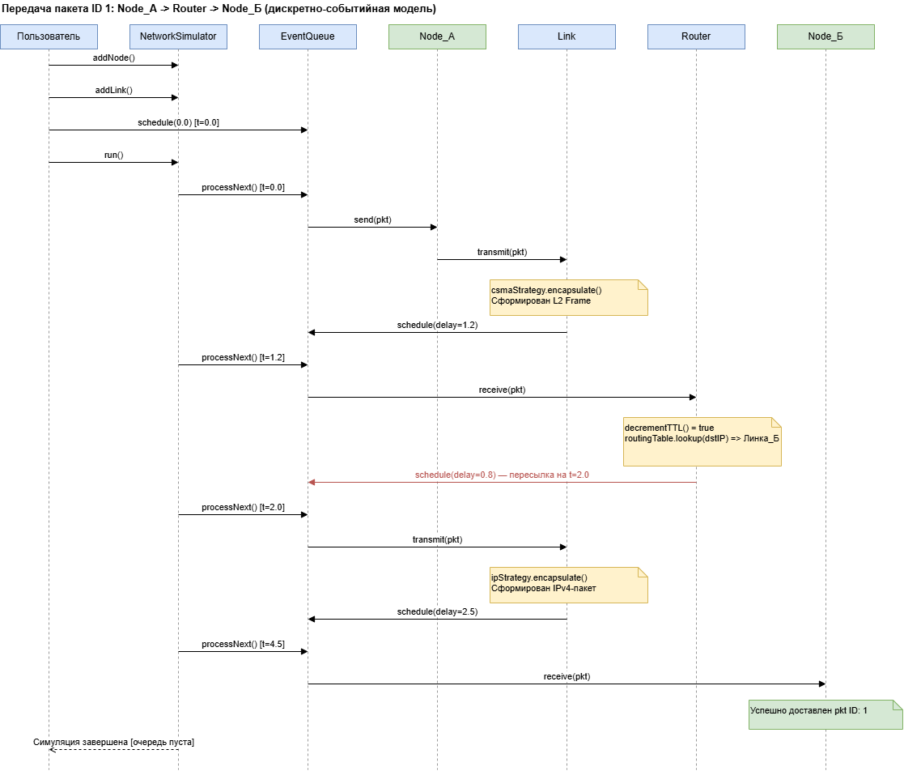

# Симулятор компьютерной сети (пакетная передача)

> Программный инструмент для моделирования поведения компьютерной сети без использования реального оборудования.
> Моделирование узлов, маршрутизаторов и протоколов (CSMA/CD, IP) на базе дискретно-событийного движка.

| | |
|---|---|
| **Язык** | C++17 |
| **Система сборки** | CMake (≥ 3.15) |
| **Тестирование** | GoogleTest (37+ кейсов) |
| **Контейнеризация** | Docker (многоэтапная сборка) |
| **Платформы** | Linux, Windows |

---

## Содержание

1. [Обзор проекта](#1-обзор-проекта)
2. [Требования](#2-требования)
3. [Архитектура и проектирование](#3-архитектура-и-проектирование)
4. [Паттерны проектирования](#4-паттерны-проектирования)
5. [Сборка и запуск](#5-сборка-и-запуск)
6. [Тестирование](#6-тестирование)
7. [Глоссарий](#7-глоссарий)

---

## 1. Обзор проекта

### 1.1. Назначение

Симулятор компьютерной сети — консольное приложение на C++, позволяющее программно описать топологию сети и запустить моделирование передачи пакетов. Пользователь задаёт узлы, соединения и протоколы, описывает сценарии передачи данных и наблюдает, как пакеты проходят по сети с учётом задержек, правил маршрутизации и ограничений протоколов.

Ядром системы является **движок дискретных событий (DES)**, который обрабатывает запланированные события строго в хронологическом порядке. Архитектура построена на принципах **ООП**, что обеспечивает расширяемость без изменения существующего кода.

### 1.2. Целевая аудитория

Студенты и исследователи, изучающие сетевые протоколы и алгоритмы маршрутизации. Взаимодействие с системой происходит через программный интерфейс на C++: пользователь описывает сценарий симуляции в коде.

### 1.3. Возможности

- Построение произвольной топологии: узлы-хосты и маршрутизаторы с IPv4-адресами.
- Настройка каналов связи с индивидуальной задержкой и протоколом инкапсуляции.
- Поддержка протоколов IP (сетевой уровень) и CSMA/CD (канальный уровень) как взаимозаменяемых стратегий.
- LPM-маршрутизация по таблицам с CIDR-записями.
- Обработка TTL и отбрасывание пакетов при истечении времени жизни.
- Фрагментация пакетов по значению MTU канала.
- Хронологический вывод событий с временны́ми метками для анализа прохождения пакетов.

### 1.4. Границы проекта (Scope)

**В рамках проекта:** моделирование сетевых узлов, маршрутизаторов, каналов связи с различными протоколами инкапсуляции и дискретно-событийного движка.

**За рамками проекта:** графический интерфейс, реальная сетевая коммуникация через сокеты, шифрование трафика, поддержка IPv6.

### 1.5. Ограничения реализации

Проект разрабатывается на языке C++. Применение сторонних библиотек допустимо, но не должно подменять собственную реализацию ключевой логики симулятора.

---

## 2. Требования

Требования структурированы по иерархии Вигерса: бизнес-требования → пользовательские → функциональные → нефункциональные. Для сбора требований применён комбинированный подход — метод User Stories (Agile) в сочетании с анализом стандартов RFC 791 (IP), RFC 826 (ARP) и IEEE 802.3 (CSMA/CD).

### 2.1. Бизнес-требования (BR)

Высокоуровневые цели и ценность системы для заинтересованных сторон (преподаватели, исследователи, студенты).

| ID | Требование |
|----|-----------|
| BR-01 | Моделирование передачи данных в сети без реального физического оборудования и сетевых соединений. |
| BR-02 | Воспроизводимые, детерминированные результаты моделирования, пригодные для сравнительного анализа топологий и конфигураций. |
| BR-03 | Расширяемая архитектура: добавление нового протокола не требует переработки существующих компонентов. |
| BR-04 | Наглядный хронологический журнал событий, позволяющий отслеживать путь каждого пакета. |
| BR-05 | Реализация с использованием промышленных инструментов: система сборки, модульное тестирование, контроль версий. |

### 2.2. Пользовательские требования (UR)

Сформулированы в виде User Stories. Главный актор — **Исследователь / Разработчик**.

| ID | User Story |
|----|-----------|
| UR-01 | Как исследователь, я хочу задавать произвольную топологию из узлов с IP-адресами, чтобы моделировать реальные конфигурации. |
| UR-02 | Как исследователь, я хочу настраивать правила маршрутизации через таблицы маршрутов, чтобы управлять путём пакетов к получателю. |
| UR-03 | Как исследователь, я хочу задавать задержку распространения сигнала для каждого канала, чтобы учитывать физические характеристики среды. |
| UR-04 | Как исследователь, я хочу выбирать протокол инкапсуляции для каждого канала (Ethernet или IP-туннель), чтобы моделировать гетерогенные сети. |
| UR-05 | Как исследователь, я хочу видеть пошаговый хронологический журнал событий, чтобы анализировать маршрут каждого пакета. |
| UR-06 | Как исследователь, я хочу, чтобы система автоматически отбрасывала пакеты с истёкшим TTL, имитируя защиту от петель маршрутизации. |
| UR-07 | Как исследователь, я хочу задавать сценарии с несколькими одновременными пакетами, чтобы исследовать поведение сети под нагрузкой. |

### 2.3. Функциональные требования (FR)

| ID | Функциональное требование |
|----|--------------------------|
| FR-01 | Создание сетевых узлов с уникальным именем и IPv4-адресом; узел принимает пакеты и фиксирует факт доставки. |
| FR-02 | Создание маршрутизаторов — узлов, способных хранить таблицы маршрутизации и перенаправлять пакеты. |
| FR-03 | Таблица маршрутизации поддерживает CIDR (например, `10.0.0.0/24`) и выбирает наиболее конкретный маршрут (алгоритм LPM). |
| FR-04 | Механизм TTL: при прохождении через маршрутизатор счётчик уменьшается; при достижении нуля пакет уничтожается. |
| FR-05 | Фрагментация пакета на части, если его размер превышает MTU канала. |
| FR-06 | Каждый канал имеет настраиваемую задержку и протокол инкапсуляции; при передаче пакет оборачивается в соответствующий заголовок. |
| FR-07 | Дискретно-событийный движок: события ставятся в очередь с временными метками и выполняются строго в хронологическом порядке. |
| FR-08 | Единая точка управления — оркестратор, через который добавляются узлы, задаются каналы и запускается симуляция. |

### 2.4. Нефункциональные требования (NFR)

| ID | Нефункциональное требование |
|----|----------------------------|
| NFR-01 | **Производительность:** очередь из 100 000 событий обрабатывается менее чем за 1 секунду на среднем ПК. |
| NFR-02 | **Портируемость:** компиляция на Linux и Windows без изменения исходного кода, стандарт C++17. |
| NFR-03 | **Надёжность:** ключевые модули покрыты автотестами, включая граничные случаи. |
| NFR-04 | **Расширяемость:** добавление протокола сводится к одному новому классу без правки каналов или движка событий. |
| NFR-05 | **Удобство сборки:** сборка стандартными командами CMake из корня без ручной настройки путей. |
| NFR-06 | **Читаемость журнала:** вывод включает временны́е метки и идентификаторы пакетов для однозначного восстановления цепочки событий. |

---

## 3. Архитектура и проектирование

Статическая и динамическая структура системы описана тремя UML-диаграммами.

### 3.1. Диаграмма вариантов использования (Use Case)

Отражает функциональные возможности с точки зрения пользователя. Единственный актор — **Исследователь сетей**. Выделено 6 прецедентов с отношениями между ними (задание топологии, настройка маршрутизации, запуск симуляции, анализ журнала и т. д.).


### 3.2. Диаграмма классов (Class Diagram)

Статическая структура системы: основные классы, их атрибуты, методы и отношения (ассоциация, наследование, агрегация/композиция). В проекте 10 классов ядра.



### 3.3. Диаграмма последовательности (Sequence Diagram)

Сценарий: успешная передача пакета от **Хоста А** через **Маршрутизатор_1** к **Хосту Б** с учётом задержек на каналах.



### 3.4. Структура каталогов проекта

```text
network_simulator/              ← Корень проекта
├── CMakeLists.txt              ← Главный конфигурационный файл CMake
├── Dockerfile                  ← Многоэтапная Docker-сборка
├── .gitignore
├── include/                    ← Публичные заголовочные файлы (.h)
│   ├── Packet.h               ← IP-пакет с TTL и фрагментацией
│   ├── Protocol.h             ← Абстрактный класс стратегии
│   ├── IP.h                   ← Протокол сетевого уровня
│   ├── CSMA_CD.h              ← Протокол канального уровня
│   ├── RoutingTable.h         ← LPM-таблица маршрутизации
│   ├── EventQueue.h           ← Дискретно-событийный движок
│   ├── Node.h                 ← Базовый класс сетевого узла
│   ├── Router.h               ← Маршрутизатор (наследник Node)
│   ├── Link.h                 ← Канал связи с задержкой
│   └── NetworkSimulator.h     ← Фасад-оркестратор
├── src/                        ← Файлы реализации (.cpp)
│   ├── Packet.cpp
│   ├── IP.cpp
│   ├── CSMA_CD.cpp
│   ├── RoutingTable.cpp
│   ├── EventQueue.cpp
│   ├── Node.cpp
│   ├── Router.cpp
│   ├── Link.cpp
│   ├── NetworkSimulator.cpp
│   └── main.cpp               ← Точка входа
└── tests/                      ← Модульные и интеграционные тесты
    ├── CMakeLists.txt          ← Конфиг сборки тестов
    ├── test_main.cpp          ← Точка входа GoogleTest
    ├── test_packet.cpp        ← Тесты Packet (13 кейсов)
    ├── test_event_queue.cpp   ← Тесты EventQueue (5 кейсов)
    ├── test_routing_table.cpp ← Тесты RoutingTable/LPM (8 кейсов)
    ├── test_nodes.cpp         ← Тесты Node и Router (6 кейсов)
    ├── test_protocols.cpp     ← Тесты IP и CSMA_CD (3 кейса)
    ├── test_infrastructure.cpp← Тесты Link и NetworkSimulator
    ├── scenario_routing.cpp   ← Интеграционный тест маршрутизации
    └── utf8_console.cpp       ← Глобальная настройка UTF-8
```

---

## 4. Паттерны проектирования

В проекте применены паттерны «Банды четырёх» (GoF) с обоснованием выбора и примерами классов.

### 4.1. Стратегия (Strategy) — поведенческий

**Задача.** Класс `Link` должен передавать пакеты как в Ethernet-фреймах (CSMA/CD), так и в IP-туннелях, причём набор протоколов расширяется. Жёсткое ветвление `if/switch` нарушило бы принцип OCP.

**Реализация.**
- `Protocol` (`include/Protocol.h`) — интерфейс стратегии: чистый виртуальный метод `encapsulate(const Packet&)`.
- `IP` (`include/IP.h`, `src/IP.cpp`) — конкретная стратегия: добавляет заголовок `IPv4_Header[Proto:6,DSCP:0]`.
- `CSMA_CD` (`include/CSMA_CD.h`, `src/CSMA_CD.cpp`) — конкретная стратегия: добавляет `Ethernet_II_Header[Type:0x0800,Preamble:CSMA/CD]`.
- `Link` (`include/Link.h`) — контекст: хранит `std::shared_ptr<Protocol>` и вызывает его в `transmit()`.

```cpp
// include/Protocol.h — Интерфейс стратегии
class Protocol {
public:
    virtual ~Protocol() = default;
    virtual Frame encapsulate(const Packet& pkt) = 0;  // чистый виртуальный
};

// src/IP.cpp — Конкретная стратегия (сетевой уровень)
Frame IP::encapsulate(const Packet& pkt) {
    return Frame{ "IPv4_Header[Proto:6,DSCP:0]", pkt };
}

// src/CSMA_CD.cpp — Конкретная стратегия (канальный уровень)
Frame CSMA_CD::encapsulate(const Packet& pkt) {
    return Frame{ "Ethernet_II_Header[Type:0x0800,Preamble:CSMA/CD]", pkt };
}

// include/Link.h — Контекст
class Link {
    std::shared_ptr<Protocol> protocolStrategy;  // ссылка на стратегию
public:
    void setProtocol(std::shared_ptr<Protocol> proto);
    void transmit(const Packet& pkt, EventQueue& queue);
};

// Использование в main.cpp
auto ipStrategy   = std::make_shared<IP>();
auto csmaStrategy = std::make_shared<CSMA_CD>();
sim.addLink(pNodeA, pRouter, 1.2, csmaStrategy); // Ethernet
sim.addLink(pRouter, pNodeB, 2.5, ipStrategy);   // IP-туннель
```

### 4.2. Команда (Command) — поведенческий

**Задача.** Симулятор должен откладывать выполнение произвольных действий (доставка пакета, логирование) до наступления нужного момента времени. Реализован через `std::function<void()>`.

**Реализация.**
- `Event` (`include/EventQueue.h`) — объект команды: хранит `double time` и `std::function<void()> action`.
- `EventQueue` — инвокер: накапливает события в приоритетной очереди и вызывает `action()` в порядке времени.
- Lambda-функции в `main.cpp` и `Link::transmit()` — конкретные команды, захватывающие контекст через замыкание.

```cpp
// include/EventQueue.h — объект команды
struct Event {
    double time;
    std::function<void()> action;  // инкапсулированная команда
    bool operator>(const Event& other) const { return time > other.time; }
};

// src/Link.cpp — создание конкретной команды (lambda с замыканием)
void Link::transmit(const Packet& pkt, EventQueue& queue) {
    // Инкапсулируем доставку пакета как команду с задержкой
    queue.schedule(delay, [dst = this->dst, pkt]() {
        if (dst) dst->receive(pkt);  // выполнится через 'delay' секунд
    });
}

// src/EventQueue.cpp — инвокер, выполняющий команды по расписанию
bool EventQueue::processNext() {
    if (queue.empty()) return false;
    Event nextEvent = queue.top();
    queue.pop();
    currentTime = nextEvent.time;
    if (nextEvent.action) nextEvent.action();  // вызов команды
    return true;
}
```

### 4.3. Шаблонный метод (Template Method) — поведенческий

**Задача.** Базовый класс `Node` определяет шаблон обработки пакета (`receive`), а `Router` переопределяет алгоритм с дополнительными шагами (TTL, LPM).

**Реализация.**
- `Node::receive()` — базовый алгоритм: сообщение об успешной доставке.
- `Router::receive()` — расширенный алгоритм: декремент TTL → LPM lookup → решение о пересылке или DROP.

```cpp
// src/Node.cpp — базовый алгоритм
void Node::receive(const Packet& pkt) {
    std::cout << "[Узел " << name << "] Успешно доставлен пакет ID: "
              << pkt.getId() << " от " << pkt.getSrcIP() << std::endl;
}

// src/Router.cpp — расширенный алгоритм с новыми шагами
void Router::receive(const Packet& pkt) {
    std::cout << "[Маршрутизатор " << name << "] Получен пакет ID: "
              << pkt.getId() << std::endl;
    Packet mutablePkt = pkt;
    // Шаг 1: проверка и декремент TTL
    if (!mutablePkt.decrementTTL()) {
        std::cout << "  [DROP] TTL истекло на " << name << std::endl;
        return;
    }
    // Шаг 2: поиск маршрута по LPM
    std::string iface = routingTable.lookup(mutablePkt.getDstIP());
    std::cout << "  -> LPM: " << mutablePkt.getDstIP()
              << " │ Путь: " << iface << " │ TTL: "
              << mutablePkt.getTTL() << std::endl;
}
```

### 4.4. Фасад (Facade) — структурный

**Задача.** Класс `NetworkSimulator` предоставляет единый упрощённый интерфейс для управления сложной подсистемой (`Node`, `Link`, `EventQueue`).

**Реализация.** Фасад скрывает управление памятью (`unique_ptr`), связывание узлов и запуск движка. Пользователь вызывает только `addNode()`, `addLink()`, `getQueue()`, `run()`.

```cpp
// include/NetworkSimulator.h — Фасад
class NetworkSimulator {
    std::vector<std::unique_ptr<Node>>  nodes;  // скрытая подсистема
    std::vector<std::unique_ptr<Link>>  links;  // скрытая подсистема
    EventQueue eventQueue;                      // скрытая подсистема
public:
    void addNode(std::unique_ptr<Node> node);       // упрощённый API
    void addLink(Node* src, Node* dst, double delay,
                 std::shared_ptr<Protocol> proto);  // упрощённый API
    EventQueue& getQueue();
    void run();  // запускает весь движок одной командой
};

// Клиентский код — работает только с Фасадом:
NetworkSimulator sim;
sim.addNode(std::make_unique<Node>("ХостА", "192.168.1.5"));
sim.addNode(std::make_unique<Router>("Router1", "192.168.1.1"));
sim.addLink(pNodeA, pRouter, 1.2, csmaStrategy);
sim.run();  // вся сложность скрыта
```

### 4.5. Потенциальное расширение: Наблюдатель (Observer)

В текущей реализации журналирование встроено в методы классов через `std::cout`. При масштабировании рекомендуется вынести регистрацию событий в паттерн «Наблюдатель»: `NetworkSimulator` — издатель, а `Logger` и `StatisticsCollector` — подписчики. Это обеспечит слабую связанность и подключение нескольких потребителей событий без изменения ядра.

### 4.6. Сводная таблица паттернов

| Паттерн | Классы в проекте | Категория GoF |
|---------|-----------------|---------------|
| Стратегия (Strategy) | `Protocol`, `IP`, `CSMA_CD`, `Link` | Поведенческий |
| Команда (Command) | `Event`, `EventQueue`, lambda в `Link`/`main` | Поведенческий |
| Шаблонный метод (Template Method) | `Node::receive()`, `Router::receive()` | Поведенческий |
| Фасад (Facade) | `NetworkSimulator` | Структурный |
| Наблюдатель (Observer) | Потенциальное расширение | Поведенческий (план) |

---

## 5. Сборка и запуск

### 5.1. Корневой `CMakeLists.txt`

```cmake
cmake_minimum_required(VERSION 3.15)          # минимальная версия CMake
project(NetworkSimulator VERSION 1.0          # имя и версия проекта
        LANGUAGES CXX)

# Стандарт языка C++17 (structured bindings, if-constexpr, std::optional)
set(CMAKE_CXX_STANDARD 17)
set(CMAKE_CXX_STANDARD_REQUIRED ON)

# Явное перечисление всех .cpp файлов ядра симулятора
set(CORE_SOURCES
    src/Packet.cpp
    src/RoutingTable.cpp
    src/EventQueue.cpp
    src/IP.cpp
    src/CSMA_CD.cpp
    src/Node.cpp
    src/Router.cpp
    src/Link.cpp
    src/NetworkSimulator.cpp
)

# Создание статической библиотеки ядра (sim_core.lib / libsim_core.a)
add_library(sim_core STATIC ${CORE_SOURCES})

# Путь к заголовочным файлам публичный (доступен линкующимся целям)
target_include_directories(sim_core PUBLIC
    ${CMAKE_CURRENT_SOURCE_DIR}/include)

# Основной исполняемый файл
add_executable(network_sim src/main.cpp)

# Линковка main-исполняемого с библиотекой ядра
target_link_libraries(network_sim PRIVATE sim_core)

# Подключение подпроекта тестов (если папка существует)
if(EXISTS "${CMAKE_CURRENT_SOURCE_DIR}/tests/CMakeLists.txt")
    add_subdirectory(tests)
endif()
```

### 5.2. `tests/CMakeLists.txt`

```cmake
cmake_minimum_required(VERSION 3.10)

# Автоматическая загрузка GoogleTest через FetchContent
include(FetchContent)
FetchContent_Declare(
  googletest
  URL https://github.com/google/googletest/archive/refs/heads/main.zip
)
set(gtest_force_shared_crt ON CACHE BOOL "" FORCE)  # для MSVC
FetchContent_MakeAvailable(googletest)

# Сборка исполняемого файла тестов из всех test_*.cpp
add_executable(run_unit_tests
    test_main.cpp
    utf8_console.cpp
    test_packet.cpp
    test_event_queue.cpp
    test_routing_table.cpp
    scenario_routing.cpp
    test_nodes.cpp
    test_protocols.cpp
    test_infrastructure.cpp
)

# Линковка с ядром симулятора и фреймворком GoogleTest
target_link_libraries(run_unit_tests PRIVATE
    sim_core gtest gtest_main)

# Регистрация в подсистеме CTest
add_test(NAME AllProjectTests COMMAND run_unit_tests)
```

### 5.3. Команды сборки и запуска

```bash
# === СБОРКА ПРОЕКТА (из корня репозитория) ===
# 1. Конфигурация: генерация файлов сборки в директорию 'build'
#    (out-of-source build — артефакты не попадают в исходники)
cmake -S . -B build

# 2. Компиляция: сборка всех целей (sim_core, network_sim, run_unit_tests)
cmake --build build

# 3. Запуск основного симулятора
cd build
./network_sim        # Linux/macOS
.\network_sim.exe    # Windows

# === ЗАПУСК ТЕСТОВ ===
# Вариант 1: напрямую через исполняемый файл GoogleTest
./tests/run_unit_tests

# Вариант 2: через CTest (покажет сводку pass/fail)
ctest --test-dir build --output-on-failure

# === СБОРКА И ТЕСТ ЧЕРЕЗ DOCKER ===
docker build -t network-simulator .                                       # сборка образа (компиляция + тесты)
docker run --rm network-simulator                                         # запуск симулятора
docker run --rm --entrypoint ./tests/run_unit_tests network-simulator     # запуск тестов
```

### 5.4. `Dockerfile` (многоэтапная сборка)

```dockerfile
# ────────────────────────────────────────────
# СТАДИЯ 1: builder — сборка и тестирование
# ────────────────────────────────────────────
FROM ubuntu:22.04 AS builder
ENV DEBIAN_FRONTEND=noninteractive

# Установка инструментов сборки C++17 + CMake + Git
RUN apt-get update && apt-get install -y \
    g++ cmake make git \
    && rm -rf /var/lib/apt/lists/*

WORKDIR /app

# Копирование структуры проекта
COPY CMakeLists.txt .
COPY include/ ./include/
COPY src/     ./src/
COPY tests/   ./tests/

# Конфигурация CMake с включением тестов
RUN cmake -S . -B build -DBUILD_TESTING=ON

# Компиляция
RUN cmake --build build

# Запуск тестов — если тесты не пройдут, сборка образа провалится
WORKDIR /app/build
RUN ctest --output-on-failure

# ────────────────────────────────────────────
# СТАДИЯ 2: runtime — минимальный образ
# ────────────────────────────────────────────
FROM ubuntu:22.04 AS runtime
RUN apt-get update && apt-get install -y libstdc++6 \
    && rm -rf /var/lib/apt/lists/*

WORKDIR /app

# Копирование только бинарников из стадии builder
COPY --from=builder /app/build/network_sim .
COPY --from=builder /app/build/tests/run_unit_tests ./tests/

ENTRYPOINT ["./network_sim"]
```

### 5.5. Пример вывода симулятора

```text
[Генерация] Формирование тестовых пакетов...
=== Запуск дискретно-событийного симулятора компьютерной сети ===

--- [Системное время: 0 c.] ---
[Событие] Хост_А начинает отправку пакета ID 1

--- [Системное время: 0 c.] ---
[Канал Хост_А -> Маршрутизатор_1] Передача инкапсулированного фрейма
    (Ethernet_II_Header[Type:0x0800,Preamble:CSMA/CD])

--- [Системное время: 1.2 c.] ---
[Маршрутизатор Маршрутизатор_1] Получен транзитный пакет ID: 1
  -> Поиск LPM. Назначение: 10.0.0.10 │ Путь: Интерфейс_Линка_Б │ TTL: 63

--- [Системное время: 2 c.] ---
[Событие] Перенаправление пакета ID 1 от Маршрутизатора к Узлу Б...
[Канал Маршрутизатор_1 -> Хост_Б] Передача инкапсулированного фрейма
    (IPv4_Header[Proto:6,DSCP:0])

--- [Системное время: 4.5 c.] ---
[Узел Хост_Б] Успешно доставлен пакет ID: 1 от 192.168.1.5

--- [Системное время: 5 c.] ---
[Событие] Попытка отправки пакета ID 2 с критическим TTL=1...
[Канал Хост_А -> Маршрутизатор_1] Передача чистого пакета без L2 заголовков

--- [Системное время: 6.2 c.] ---
[Маршрутизатор Маршрутизатор_1] Получен транзитный пакет ID: 2
  ❌ [DROP] Время жизни пакета (TTL) истекло на маршрутизаторе Маршрутизатор_1

=== Моделирование завершено. Очередь событий пуста. ===
```

---

## 6. Тестирование

Проект покрыт **37+ тест-кейсами**, сгруппированными в 8 тестовых файлов. Все тесты успешно проходят при сборке через CMake + GoogleTest.

| Тестовый файл | Покрываемые классы | Кол-во кейсов |
|---------------|--------------------|---------------|
| `test_packet.cpp` | `Packet` (TTL, фрагментация) | 13 |
| `test_event_queue.cpp` | `EventQueue` (сортировка, очистка) | 5 |
| `test_routing_table.cpp` | `RoutingTable` (LPM, CIDR, DROP) | 8 |
| `test_nodes.cpp` | `Node`, `Router` (receive, TTL, LPM) | 6 |
| `test_protocols.cpp` | `IP`, `CSMA_CD` (encapsulate) | 3 |
| `test_infrastructure.cpp` | `Link`, `NetworkSimulator` | 9 |
| `scenario_routing.cpp` | Интеграция: многоузловой маршрут + TTL | 1 сценарий |
| `utf8_console.cpp` | Глобальная настройка локали UTF-8 | — |

---

## 7. Глоссарий

| Термин | Определение | Контекст |
|--------|-------------|----------|
| **CSMA/CD** | Carrier Sense Multiple Access / Collision Detection — множественный доступ с контролем несущей и обнаружением коллизий | Канальный уровень (IEEE 802.3) |
| **IP** | Internet Protocol — протокол межсетевого взаимодействия (адресация и маршрутизация) | Сетевой уровень OSI, RFC 791 |
| **LPM** | Longest Prefix Match — выбор маршрута с наиболее длинным совпадающим префиксом CIDR | Таблица маршрутизации |
| **TTL** | Time To Live — счётчик жизни пакета; при TTL=0 пакет уничтожается | Поле IP-заголовка |
| **MTU** | Maximum Transmission Unit — максимальный размер полезной нагрузки для одной передачи | Канал / IP-фрагментация |
| **DES** | Discrete Event Simulation — моделирование, при котором состояние меняется только в моменты наступления событий | Движок симулятора |
| **CIDR** | Classless Inter-Domain Routing — бесклассовая адресация вида `A.B.C.D/N` | Таблица маршрутизации |

---

## Приложение. Контекст разработки

Документация подготовлена на основе практических заданий №2 и №3 по дисциплине «Программирование корпоративных систем» (тема проекта №24 — «Симулятор компьютерной сети (пакетная передача)»), Институт перспективных технологий и индустриального программирования, МИРЭА — Российский технологический университет, 2025–2026 уч. г.